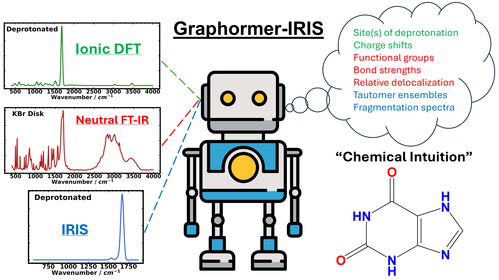
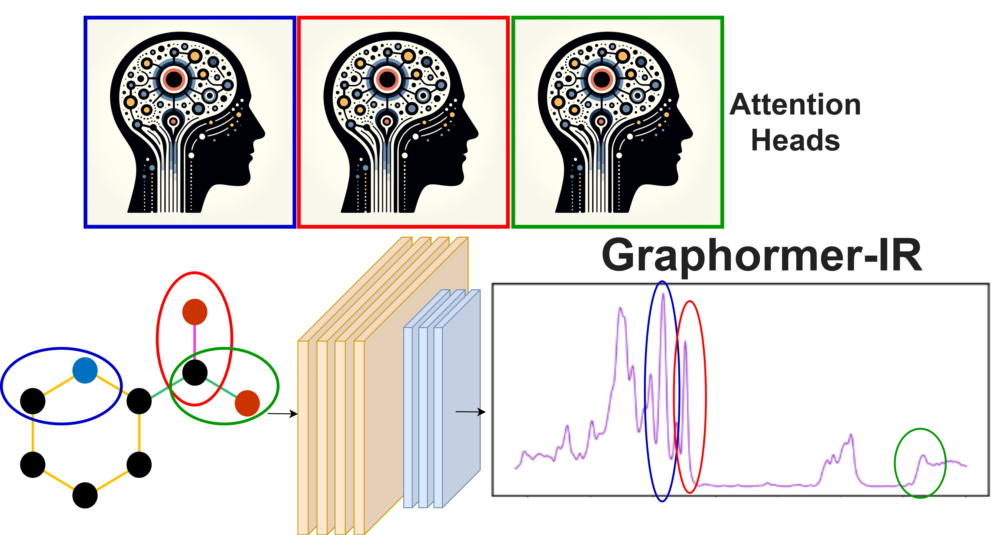

    
# New Updates (April 2025) Graphormer-IR(IS)
- Updated to include Graphormer-IRIS code from recent publication (Merged Graphormer-IR and IRIS branches)
- Added command line tools for freezing layers, freezing feature encoder, 
- Fixed issues with relative paths, pickle files not uploaded
- Added docker installation route and guide
- Made it easier to save data by adding '--save-path' flag for evaluation script

# General
Graphormer-IR(IS) is an extension to the Graphormer package, with [documentation](https://graphormer.readthedocs.io/), and the original code on [Github](https://github.com/microsoft/Graphormer/) with additional usage examples. If you use this code, __please cite our paper and the original Graphormer work__:

@article{Stienstra2025,
   abstract = {Machine learning models for predicting IR spectra of molecular ions (infrared ion spectroscopy, IRIS) have yet to be reported owing to the relatively sparse experimental data sets available. To ove...},
   author = {Cailum M. K. Stienstra and Teun van Wieringen and Liam Hebert and Patrick Thomas and Kas J. Houthuijs and Giel Berden and Jos Oomens and Jonathan Martens and W. Scott Hopkins},
   doi = {10.1021/ACS.JCIM.4C02329},
   issn = {1549-9596},
   journal = {Journal of Chemical Information and Modeling},
   month = {2},
   publisher = {American Chemical Society},
   title = {A Machine-Learned “Chemical Intuition” to Overcome Spectroscopic Data Scarcity},
   url = {https://pubs.acs.org/doi/full/10.1021/acs.jcim.4c02329},
   year = {2025}
}

@article{Stienstra2024,
   author = {Cailum M. K. Stienstra and Liam Hebert and Patrick Thomas and Alexander Haack and Jason Guo and W. Scott Hopkins},
   doi = {10.1021/ACS.JCIM.4C00378},
   issn = {1549-9596},
   journal = {Journal of Chemical Information and Modeling},
   month = {6},
   publisher = {American Chemical Society},
   title = {Graphormer-IR: Graph Transformers Predict Experimental IR Spectra Using Highly Specialized Attention},
   url = {https://pubs.acs.org/doi/abs/10.1021/acs.jcim.4c00378},
   year = {2024},
}

@inproceedings{
ying2021do,
title={Do Transformers Really Perform Badly for Graph Representation?},
author={Chengxuan Ying and Tianle Cai and Shengjie Luo and Shuxin Zheng and Guolin Ke and Di He and Yanming Shen and Tie-Yan Liu},
booktitle={Thirty-Fifth Conference on Neural Information Processing Systems},
year={2021},
url={https://openreview.net/forum?id=OeWooOxFwDa}
}

# Installation
## Docker [April 2025]
We have developed a Docker Image to make installation and management of environments easier for Graphormer-IR. Installation Instructions are as follows

📦 How to Install and Run Graphormer-IR Using Docker Image
1.	Install the following software (if not already installed):
- Docker: https://docs.docker.com/get-docker/
- NVIDIA GPU drivers: https://www.nvidia.com/Download/index.aspx
- NVIDIA Container Toolkit: https://docs.nvidia.com/datacenter/cloud-native/container-toolkit/install-guide.html

You can verify installation via the following commands: 
```bash
docker --version
```
```bash
nvidia-smi
```
```bash
nvidia-container-cli --version
```

2.	Save the Dockerfile (the name should be “Dockerfile”).
3.	Open a terminal in the same folder as Dockerfile.
4.	Build the Docker image by running:
		docker build --no-cache -t graphormer-ir .
5.	Run the Docker container with GPU support:
docker run -it --gpus all graphormer-ir bash
6.	Inside the container, navigate to the example directory, make the example script executable, and run the example script:
```bash
cd /workspace/Graphormer-IR/examples/property_prediction
chmod +x IRspec.sh  
./IRspec.sh  
```
7.	If it runs for an epoch and saves .pt files, you know you’ve succeeded. 

A beginner's guide to Docker usage can be found [HERE](https://docker-curriculum.com/)

- To Upload files (e.g., new data) to the docker container, use:
```bash
docker cp ./local_file.txt container_id:/app/local_file.txt
```
- To Download files (checkpoints, results) from this container, use:
```bash
docker cp <container_id>:<path_inside_container> <path_on_host> 
```
## Old Instructions [Before April 2025]
We highly recommend following the [installation guide](https://graphormer.readthedocs.io/), though we will suggest a few additional notes to make things easier:
- Install fairseq directly from the [Github repository](https://github.com/facebookresearch/fairseq), "pip install -e /path/to/folder" Make sure that you're using an old enough version that's compatible with Graphormer
- Make sure that you're using an old enough version of PyTorch Geometric and the DGL libraries (there's a lookup table for compatibility on their website). These are the things that we found broke the most frequently, and the errors you get don't always tell you that it's these packages. If there are problems inheriting abstract data classes, just modify the class methods to include whatever class methods (e.g., "\_\_len\_\_"), in your install and it should work.
- Refer to "requirement.txt" if you have any problems with version compatability.
- Ensure that your CUDA and pytorch geometric versions are compatabile. 


# Data
Large collections of infrared spectra are owned by private organizations across a variety of domains, and no unified “machine learning ready” data set is available. As such, it was necessary to obtain, clean, and process a library of IR spectra from several different domains. IR spectra were obtained from three online sources: the National Institute of [Advanced Industrial Science and Technology (AIST)](https://sdbs.db.aist.go.jp/), the [National Institute of Standards and Technology (NIST)](https://webbook.nist.gov/chemistry/), and the [Coblentz Society](https://www.coblentz.org/). Complete data access statements can be found in our original publication in the Supporting Information for the Graphormer-IR manuscript.

Since we are unable to provide this data, we instead provide sample data in /scripts/sample_data/ and indices that interface with our code and to provide an approximate template for evaluation. 

# Usage
This repository contains the code you need to reproduce the work in our recent publications. Most of our usage is identical to that found in the original Graphormer paper.

- We have included dataloaders for IR, IRIS, and DFT spectra found in examples/property prediciton with bash scripts to run training. Here you can tune model hyperparameters, finetune pre-trainined models (while freezing layers), and change your data source
- Our learned graph node feature encoder is found in /graphormer/modules/graphormer_layers.py. If you change the number/shape of input node features you will have to edit this code as well
- The model itself is in /graphormer/models/graphormer.py. Most hyperparameters can be tuned from the bash scripts
- Once you have a trained model, evaluation occurs at /graphormer/evaluate/evaluate.sh. Make sure your model hyperparameteres match those used in training.
- Evaluation functions are found at /graphormer/evaluate/evaluate.py - you can extract your predicted spectra, SMILES codes, and SIS scores. Data can be saved by modifying the save_path flag in teh bash script
- Additional data manipulation scripts (baseline correction, etc.) can be found in /scripts/
- Sample data for training IR and DFT models are found in /sample_data/. IRIS spectra were not released in this study because of conflicts with other publications. The model weights trained on this data are available at Zenodo (see below)

# Models

The five best performing Graphormer-IR models (full set of node features, learned node features, combinatoric edges, etc.), discussed in detail in the manuscript are freely available online at [Zenodo](https://zenodo.org/records/10790190). These can be used for model evaluation using the evaluate.sh script and accompanying dataloader. 

**[APRIL 2025 UPDATE]**  
Graphormer-IRIS models are available at [Zenodo](https://zenodo.org/records/14628870)

# Common Errors

"Segmentation Fault... Core Dumped" may indicate that you have installed the incorrect version of PyTorch Geometric (https://data.pyg.org/whl/). This can be further tested by checking the package import (e.g., from pytorch_geometric.data import data)

# Contact

If you require further assistance with developing your own model or have any questions about its implementaton, the authors can be contacted at 

- cmkstien@uwaterloo.ca
- liam.hebert@uwaterloo.ca
- scott.hopkins@uwaterloo.ca. 

