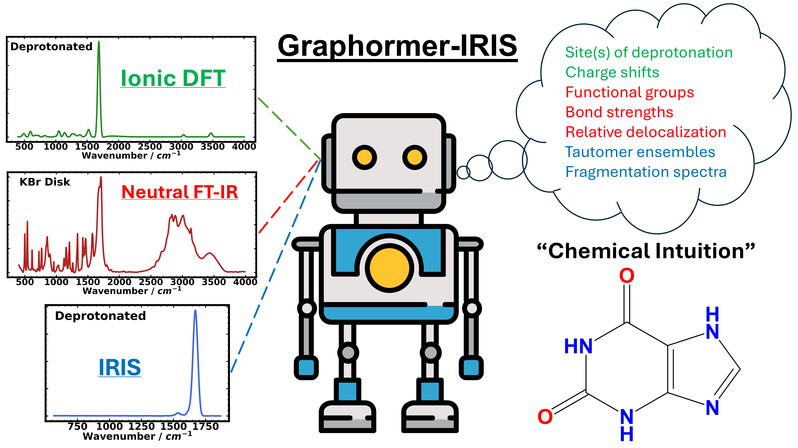

 

# General
Graphormer-IR is an extension to the Graphormer package, with [documentation](https://graphormer.readthedocs.io/), and the original code on [Github](https://github.com/microsoft/Graphormer/) with additional usage examples. If you use this code, __please cite our paper and the original Graphormer work__:

@article{Stienstra2024,
   author = {Cailum M. K. Stienstra and Liam Hebert and Patrick Thomas and Alexander Haack and Jason Guo and W. Scott Hopkins},
   doi = {10.1021/ACS.JCIM.4C00378},
   issn = {1549-9596},
   journal = {Journal of Chemical Information and Modeling},
   month = {6},
   publisher = {American Chemical Society},
   title = {Graphormer-IR: Graph Transformers Predict Experimental IR Spectra Using Highly Specialized Attention},
   url = {https://pubs.acs.org/doi/abs/10.1021/acs.jcim.4c00378},
   year = {2024},
}

@inproceedings{
ying2021do,
title={Do Transformers Really Perform Badly for Graph Representation?},
author={Chengxuan Ying and Tianle Cai and Shengjie Luo and Shuxin Zheng and Guolin Ke and Di He and Yanming Shen and Tie-Yan Liu},
booktitle={Thirty-Fifth Conference on Neural Information Processing Systems},
year={2021},
url={https://openreview.net/forum?id=OeWooOxFwDa}
}

# Installation
We highly recommend following the [installation guide](https://graphormer.readthedocs.io/), though we will suggest a few additional notes to make things easier
- Install fairseq directly from the [Github repository](https://github.com/facebookresearch/fairseq), "pip install -e /path/to/folder" Make sure that you're using an old enough version that's compatible with Graphormer
- Make sure that you're using an old enough version of PyTorch Geometric and the DGL libraries (there's a lookup table for compatibility on their website). These are the things that we found broke the most frequently, and the errors you get don't always tell you that it's these packages. If there are problems inheriting abstract data classes, just modify the class methods to include whatever class methods (e.g., "\_\_len\_\_"), in your install and it should work.
- Refer to "Requirements_Graphormer.txt" if you have any problems with version compatability.

# Data
Large collections of infrared spectra are owned by private organizations across a variety of domains, and no unified “machine learning ready” data set is available. As such, it was necessary to obtain, clean, and process a library of IR spectra from several different domains. IR spectra were obtained from three online sources: the National Institute of [Advanced Industrial Science and Technology (AIST)](https://sdbs.db.aist.go.jp/), the [National Institute of Standards and Technology (NIST)](https://webbook.nist.gov/chemistry/), and the [Coblentz Society](https://www.coblentz.org/). Complete data access statements can be found in our original publication in the Supporting Information for the Graphormer-IR manuscript.

Since we are unable to provide this data, we instead provide sample data in /scripts/sample_data/ and indices that interface with our code and to provide an approximate template for evaluation. 

# Usage
This repository contains the code you need to reproduce the work in our recent publication (https://doi.org/10.1021/acs.jcim.4c00378). Most of our usage is identical to that found in the original Graphormer paper. But to briefly summarize the novelties and changes in this work

- Training models can be accomplished using the /examples/property_prediction/IR_spec.sh script. Here you can tune most model parameters.
- Training data is loaded from  /examples/property_prediction/training_dataset/IrSpectraDataset_train.py. Here you can modify node features, edge features, where we perform combinatoric edge mapping, and we manually add on the global graph node to describe solvent phase. We use modified versions of the DGLLifeScience featurization functions (found in featurizing_helpers.py)
- Our learned graph node feature encoder is found in /graphormer/modules/graphormer_layers.py. If you change the number/shape of input node features you will have to edit this code as well
- The model itself is in /graphormer/models/graphormer.py. Most hyperparameters can be tuned from the bash script"
- Once you have a trained model, evaluation occurs at /graphormer/evaluate/evaluate.sh. Make sure your model hyperparameteres match those from the model that you trained on. 
- Evaluation functions are found at /graphormer/evaluate/evaluate.py - you can extract your predicted spectra, SMILES codes, and SIS scores from this script if you want to export the data
- The scripts that we used for spectral preprocessing are available in /scripts/, performing molecular filtering, phase consolidation, baseline aliasing, interpolation, phase exclusion, etc. 

# Models

The five best performing Graphormer-IR models (full set of node features, learned node features, combinatoric edges, etc.), discussed in detail in the manuscript are freely available online at [Zenodo](https://zenodo.org/records/10790190). These can be used for model evaluation using the evaluate.sh script and accompanying dataloader. 

# Common Errors

"Segmentation Fault... Core Dumped" may indicate that you have installed the incorrect version of PyTorch Geometric (https://data.pyg.org/whl/). This can be further tested by checking the package import (e.g., from pytorch_geometric.data import data)

# Contact

If you require further assistance with developing your own model or have any questions about its implementaton, the authors can be contacted at 

- cmkstien@uwaterloo.ca
- liam.hebert@uwaterloo.ca
- p7thomas@uwaterloo.ca
- scott.hopkins@uwaterloo.ca. 

